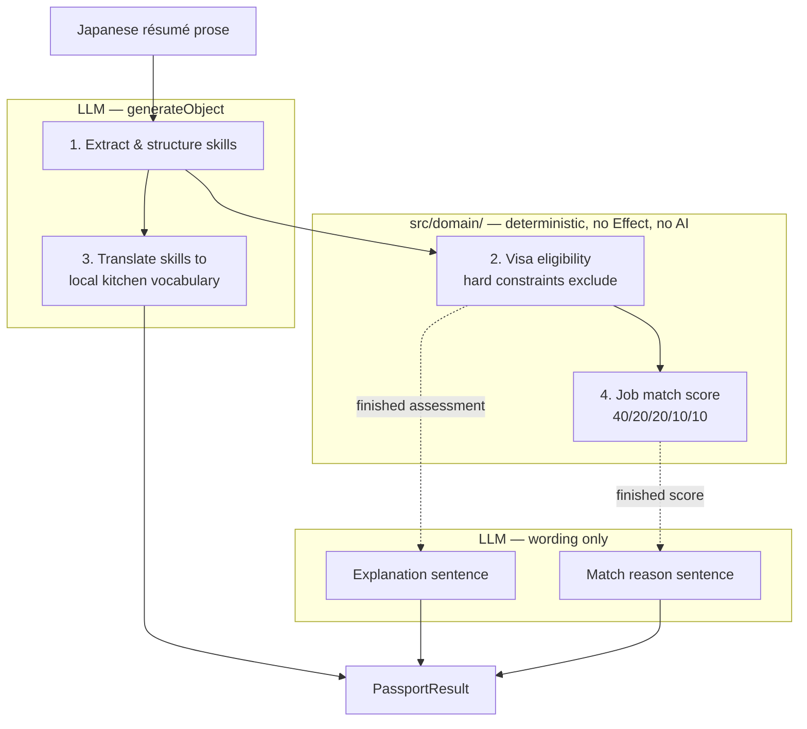

# Chef Passport

A cross-border matching PoC: enter a Japanese chef's career history, and it tells you **which
country, which kitchen, and which visa** would actually work for them.

Three countries (Singapore / Australia / United States), six work visas, fifteen mock job listings,
three preset chefs.

> ⚠ Visa requirements and job listings here are **mock data for demonstration**, not legal advice.
> Every visa card links the real government page it is modelled on.

## The design claim

**Judgement is deterministic; only the wording is generated.**

The obvious way to build this is to hand all four pipeline steps to a model, including "score these
fifteen jobs 0-100" and "is this chef eligible for an Employment Pass". That is one prompt and no
domain code. It is also unverifiable, non-reproducible, and a weaker story — you cannot test it,
point at a threshold, or explain a wrong answer.

So eligibility and scoring are pure functions in `src/domain/`, which imports neither Effect nor
React nor any AI package at runtime. The model only writes sentences _about_ results that have
already been decided.



The dotted edges are the whole point: the model receives the _finished_ assessment, so there is no
path by which its prose can disagree with the judgement.

Hard constraints — sponsorship unavailable, age over the cap, salary below the visa floor, missing
evidence proof, a visa that needs a seasonal role — **exclude rather than subtract**, and the
exclusion reason is rendered on screen. That visible reason is what makes the logic's existence
observable rather than merely asserted.

See [`docs/adr/0003-deterministic-scoring.md`](docs/adr/0003-deterministic-scoring.md).

## Why you can believe it

`src/domain/expected-outcomes.test.ts` asserts the promised outcome table directly:

| Persona   | SG  | AU  | US  | Deciding factor                                                 |
| --------- | --- | --- | --- | --------------------------------------------------------------- |
| 佐藤 匠   | ◎   | ○   | △   | EP salary floor cleared; 417 blocked by age; O-1 needs evidence |
| 鈴木 遥   | ○   | ○   | △   | balanced; 482 sponsorship path                                  |
| 高橋 健太 | △   | ○   | △   | SG salary floors unreachable; 417 only                          |

The table is the specification; the visa figures and job salaries were designed backwards from it.
Suzuki and Takahashi both land on AU ○ **via different visas** — Suzuki clears 482, Takahashi is
blocked on its income floor and clears 417 instead. That divergence is asserted too, because it is
what shows the mechanism is general rather than a fixed output.

## One Stream, two sources

`PassportPipeline` exposes a single `Stream<PipelineEvent>`. Preset personas replay a committed
cache; free input generates live. **Only the Layer differs** — the UI never branches on which is
active.

The stream has no error channel: failures arrive as a `Failed` event, because a server function must
return plain serializable data and an `Effect` failure is not that.

The cache is generated by `vp run generate:passport`, which drives the real pipeline and records
each step's **measured** duration. Replay uses those recorded values, clamped to 0.8-2.5 s — real
timing, not a decorative progress bar. `PassportResult.proseSource` records whether the wording came
from the model or from the deterministic fallback, so the two can never be confused.

## Layout

```
src/
├── domain/        pure functions — visa-eligibility.ts, scoring.ts. No Effect, no React, no AI
├── data/          schemas, JSON fixtures, loaders that decode, committed cache
├── features/      passport/{api,components,hooks,types}
├── lib/           runtime.ts — the single Layer composition point; ai-client.ts
├── routes/        thin adapters: /, /passport/$personaId, /free
└── testing/       setup, render helper, server-fn mock, itEffect
scripts/           generate-passport.ts — runs under plain Node
```

## Getting started

Requires Node ≥ 24.17 (see `.node-version`) and the [Vite+](https://viteplus.dev/guide/) `vp` CLI.

```bash
vp install
vp dev            # preset personas work with no API key and no network
```

| Command                    | Purpose                                         |
| -------------------------- | ----------------------------------------------- |
| `vp check`                 | Format + lint + typecheck (`--fix` to auto-fix) |
| `vp test`                  | All tests                                       |
| `vp build`                 | Production build (Nitro → Vercel)               |
| `vp run generate:passport` | Regenerate the committed pipeline cache         |
| `vp run fallow`            | Unused files / exports / dependencies           |
| `vp run doctor`            | React health checks                             |

Add `-- --offline` to `generate:passport` to write deterministic prose instead of calling the model;
it is recorded as `proseSource: "deterministic"` and surfaced in the UI as a banner.

## Environment

Copy the three names below into `.env`. All are server-only — never use a `VITE_` prefix, which
would inline the value into the client bundle, and read them inside the handler rather than at
module scope, which is evaluated during bundling.

| Name                  | Notes                                                             |
| --------------------- | ----------------------------------------------------------------- |
| `AI_GATEWAY_API_KEY`  | Vercel AI Gateway key                                             |
| `AI_GATEWAY_BASE_URL` | Defaults to `https://ai-gateway.vercel.sh` (no trailing `/v1`)    |
| `ENABLE_FREE_INPUT`   | `false` by default. Free input calls a paid API from a public URL |

Model slugs must be provider-prefixed (`anthropic/claude-haiku-4.5`); a bare slug returns 404.

## Documentation

- [`PLAN.md`](PLAN.md) — how it is built: boundaries, schemas, rules, routes, test layers
- [`docs/requirement.md`](docs/requirement.md) — what it is (Japanese)
- [`docs/adr/`](docs/adr/) — stack choice, gateway routing, deterministic scoring
- [`AGENTS.md`](AGENTS.md) — Vite+ workflow and project rules

## License

[MIT](LICENSE.md).
