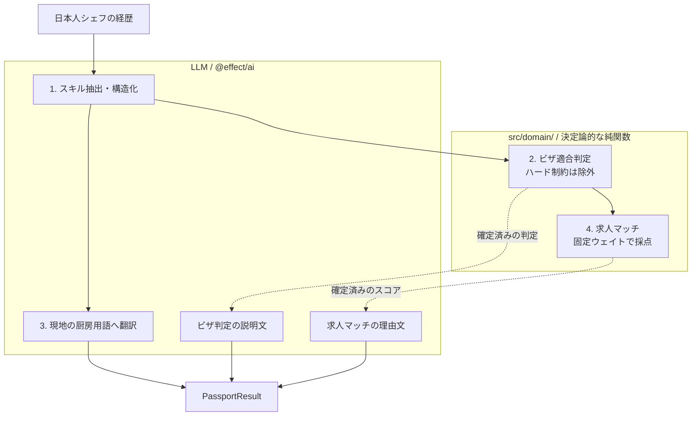

# Chef Passport（PoC）

> 日本人シェフの経歴を、海外就労の選択肢へ翻訳するクロスボーダー・マッチングPoC

## このPoCについて

本リポジトリは、日本人シェフが海外で働く選択肢を検討するときに生じる課題を仮定して作成したPoC（Proof of Concept）です。

実際の人材紹介業務・求人・ビザ審査を再現したものではありません。

**「職人としての経験を構造化し、国・ビザ・求人ごとの適合理由を説明可能な形で提示できれば、海外就労の最初の一歩を具体化できるのではないか」**

という仮説を、3人のプリセットシェフ、3カ国、6種類の就労ビザ、15件のモック求人で検証しています。

想定ユーザーは、海外就労に関心がある日本人シェフと、そのキャリア選択を支援する担当者です。シェフ本人が結果を見るだけでなく、支援者が「なぜこの国・ビザ・求人なのか」を説明できることも重視しています。

特定の企業・団体のサービスや業務フローを再現したものではありません。

## 目次

- [デモ](#デモ)
- [背景](#背景)
- [解決したい課題](#解決したい課題)
- [PoCのコンセプト](#pocのコンセプト)
- [デモフロー](#デモフロー)
- [自由入力サンプル](#自由入力サンプル)
- [主な機能](#主な機能)
- [期待結果](#期待結果)
- [アーキテクチャ](#アーキテクチャ)
- [判定ルール](#判定ルール)
- [安全上の制約](#安全上の制約)
- [技術構成](#技術構成)
- [セットアップ](#セットアップ)
- [本番環境とVercelへのデプロイ](#本番環境とvercelへのデプロイ)
- [品質ゲート](#品質ゲート)
- [現在の限界](#現在の限界)
- [今後の展望](#今後の展望)

## デモ

**Production:** [https://chef-passport-poc.vercel.app](https://chef-passport-poc.vercel.app)

3人のプリセットシェフはコミット済みキャッシュから再生するため、AI Gatewayを呼ばずに試せます。自由入力とライブ生成は、本番環境のAI Gateway設定と利用上限の範囲で動作します。

### プリセットシェフ

https://github.com/user-attachments/assets/31fd67be-6462-4da0-97bc-7b39c64eac14

### 自由入力

https://github.com/user-attachments/assets/eb988887-41da-4d0a-a697-7619700b6000

## 背景

日本の厨房で培われた経験は、履歴書の文章だけでは海外の採用・ビザ要件と結びつけにくいことがあります。

- 「白身を柳刃で引ける」「おまかせを構成できる」といった技能を、現地の厨房で通じる表現へ置き換える必要がある
- 国ごとにスポンサー、給与、年齢、経験、実績証明などの条件が異なる
- ビザに通る可能性と、求人との相性は別々に評価する必要がある
- LLMに判定まで任せると、同じ入力でも結果が揺れ、理由を検証しにくい

Chef Passportでは、自然言語の経歴を入口にしながら、適合判定と求人スコアをコードで再現可能にする構成を採用しました。

## 解決したい課題

| #   | 課題                                                                       |
| --- | -------------------------------------------------------------------------- |
| ①   | 経歴が自然言語のままで、**スキル・経験年数・専門ジャンルを比較しにくい**   |
| ②   | 国ごとに条件が異なり、**どのビザが候補になり、何が障壁なのか分かりにくい** |
| ③   | 日本固有の職人スキルを、**海外の厨房で通じる言葉へ変換しにくい**           |
| ④   | LLMだけで採点すると、**結果の再現・テスト・説明が難しい**                  |

## PoCのコンセプト

AIに就労可否を決めさせるPoCではありません。

AIが担当するのは、経歴の構造化、スキル表現の翻訳、確定済み結果の説明文生成です。ビザ適合判定、国別評価、求人スコア、並び順は [`src/domain/`](./src/domain/) の純関数が決めます。

```text
AI: 経歴を読む・翻訳する・説明する
コード: 条件を照合する・採点する・除外する・並べる
人: モックデータであることを理解し、最終判断する
```

この境界により、LLMの言い回しが変化しても、同じ入力から得られる判定とスコアは変わりません。

## デモフロー

本番環境またはローカル環境でデモできます。APIキーなしでも、3人のプリセットシェフはコミット済みキャッシュから動作します。

1. [本番デモ](https://chef-passport-poc.vercel.app)を開く。ローカルで確認する場合は、[セットアップ](#セットアップ)の手順でアプリを起動し、`http://localhost:3000` を開く
2. ホーム画面で「ライブ生成（AIを実際に呼ぶ）」をオフのままにする
3. 3人のプリセットから1人を選ぶ
4. 次の4ステップが順番に表示されることを確認する
   1. スキルを抽出・構造化
   2. 国別のビザ要件と照合
   3. スキル表現を現地の厨房用語へ変換
   4. 海外求人とマッチング・スコアリング
5. 結果ダッシュボードで、国別適合度、ビザごとの通過・除外理由、スキル翻訳、求人マッチを確認する
6. `AI_GATEWAY_API_KEY` が設定された環境では、次のライブ導線も試す
   - ホームのライブ生成をオンにしてプリセットを再判定する
   - `/free` で任意の経歴、年齢、語学レベル、実績証明の有無を入力する

> **ライブ生成でエラーが出た場合**
>
> - プリセットは途中結果を破棄し、同じシェフのコミット済みキャッシュへ切り替えます。
> - 自由入力にはキャッシュがないため、スキル抽出が失敗すると結果を返せません。説明文だけが失敗した場合は、判定を維持したまま決定論的な説明文へ縮退します。
> - 同時実行、プロセス単位の実行予算、AI Gatewayの利用上限に達したリクエストは拒否されます。詳細は[安全上の制約](#安全上の制約)を参照してください。

## 自由入力サンプル

`AI_GATEWAY_API_KEY`を設定した環境では、`/free`へ次の経歴文をそのまま貼り付けて試せます。年齢・語学・実績証明は経歴文から推測せず、表の値をフォームで選択してください。

ライブ生成ではLLMが経歴からスキル・経験年数・専門ジャンルを抽出します。その後のビザ判定と求人スコアは決定論的ですが、抽出結果によって最終表示が変わる可能性があるため、国別評価は保証値ではなくデモ上の「狙い」として記載しています。

### パターン1 — 寿司・割烹

シンガポールの高評価を狙いつつ、実績証明が必要なO-1の分岐も確認しやすい経歴です。

| 項目         | 推奨値                             |
| ------------ | ---------------------------------- |
| 年齢         | 34                                 |
| 語学         | 日常会話                           |
| 実績証明     | ON（メディア掲載・コンペ入賞あり） |
| デモ上の狙い | SG ◎ / O-1の実績証明分岐           |

```text
赤坂の寿司店で10年、直近4年はカウンターの立板です。白身は鯛・平目・真子を柳刃で引き、丸魚の卸しも毎朝自分でやります。握りはシャリの塩梅から一貫の形まで担当で、おまかせ12貫の構成は毎月組み替えています。会席の前菜から焼き物まで一通り回せるので、寿司と割烹のあいだを横断する厨房に慣れていました。出汁は昆布と枯節の合わせで店の基準を決め、季節の走りと名残を意識した献立設計も任されていました。衛生管理はHACCPの記録作成を担当。英語はカウンターで海外客にネタの説明ができる程度です。都内の食メディアに一度掲載され、業界の小規模コンペで包丁部門の入賞があります。
```

### パターン2 — フレンチ

経験・調理技術・店舗運営のバランスから、オーストラリアのスポンサー経路を見せやすい経歴です。

| 項目         | 推奨値              |
| ------------ | ------------------- |
| 年齢         | 29                  |
| 語学         | 簡単な英会話        |
| 実績証明     | OFF                 |
| デモ上の狙い | AU 482 / バランス型 |

```text
代々木上原のフレンチで6年、直近2年はスーシェフです。ソースが軸で、ヴィシソワーズからジュ、ブールブランまでフォンから詰めて日々ひいています。低温調理はタンパクごとの温度帯を表にして店の標準手順に落とし込みました。盛り付けはスケッチを描いてからプレートを組み立てる進め方で、ランチのアミューズからメインまで自分で設計しています。製菓担当が休みの日はプレートデザートも一人で回します。衛生はHACCP文書の更新を担当し、仕込みの原価も週次で見ています。英語は簡単な受け答えとレシピ用語なら大丈夫ですが、長い交渉は苦手です。受賞歴やメディア掲載はありません。
```

### パターン3 — ラーメン店長

店舗運営経験を持ちながら語学要件では不利になり、年齢条件を満たす417だけが候補になる分岐を見せやすい経歴です。

| 項目         | 推奨値                    |
| ------------ | ------------------------- |
| 年齢         | 27                        |
| 語学         | ほぼ不可                  |
| 実績証明     | OFF                       |
| デモ上の狙い | AU 417 / 語学要件との対比 |

```text
横浜の家系ラーメン店で7年、直近3年は店長です。豚骨と鶏ガラの寸胴を朝から1日3本仕込み、季節の水温差に合わせて炊き時間と火加減を調整しています。麺は加水率の違う3種を使い分け、スープの濃度に合わせて選定していました。チャーシューは巻きから煮込み、切り出しまで担当です。店舗運営は発注・在庫・原価・シフトまで一通り見ており、原価率を2ポイント下げた実績があります。新人6名の教育と衛生マニュアルの整備も担当しました。英語はほぼ話せません。受賞歴やメディア掲載はありません。海外でラーメン店を立ち上げる厨房に入りたいと考えています。
```

面接デモでは、パターン1で国カードと実績証明の影響を見せたあと、パターン3で「417だけが通る」分岐を見せると、入力によって判定ロジックが変化することを説明しやすくなります。

## 主な機能

| 機能            | 内容                                                |
| --------------- | --------------------------------------------------- |
| プリセット選択  | 年齢・専門・経験・語学が異なる3人から選択           |
| 4ステップ可視化 | キャッシュ再生とライブ生成を同じ進行UIで表示        |
| 国別適合判定    | シンガポール、オーストラリア、アメリカを評価        |
| ビザ要件の照合  | 6種類のモックビザについて、通過状況と除外理由を表示 |
| スキル翻訳      | 日本語の職人スキルを現地の厨房向け表現へ変換        |
| 求人マッチ      | 15件のモック求人を決定論的に採点・除外・並べ替え    |
| 自由入力        | スキーマ検証した経歴からライブパイプラインを実行    |
| キャッシュ退避  | APIキーやネットワークがなくてもプリセットを再生     |

## 期待結果

3人のプリセットは、同じロジックから異なる結果が出るよう設計しています。

| ペルソナ  | SG  | AU  | US  | 主な理由                                                       |
| --------- | --- | --- | --- | -------------------------------------------------------------- |
| 佐藤 匠   | ◎   | ○   | △   | EPの給与基準をクリア。417は年齢上限を超過。O-1は実績証明が不足 |
| 鈴木 遥   | ○   | ○   | △   | 経験・語学のバランスがあり、AUでは482のスポンサー経路が候補    |
| 高橋 健太 | △   | ○   | △   | SGの給与下限に届かない一方、年齢条件を満たす417が候補          |

この表は [`src/domain/expected-outcomes.test.ts`](./src/domain/expected-outcomes.test.ts) に直接アサートされています。

鈴木と高橋はどちらもAUが「○」ですが、候補ビザは482と417で異なります。表示だけを固定したのではなく、年齢、経験、給与、スポンサー条件から分岐した結果です。

## アーキテクチャ



点線が設計の核です。LLMは確定済みの判定とスコアを受け取り、その理由を文章にします。判定値や順位を変更する経路はありません。

画面への配送は、キャッシュとライブのどちらも同じイベント型を使います。

```text
/  シェフ選択
└─ /passports/{personaId}  進行表示 → 結果ダッシュボード
└─ /free                   自由入力 → 進行表示 → 結果ダッシュボード
          │
          ▼
PassportPipeline: Stream<PipelineEvent>
          │
          ├─ キャッシュLayer: コミット済みJSONを再生
          └─ ライブLayer: Effect + @effect/ai → Vercel AI Gateway
```

サーバー関数からは、`Effect`、`Exit`、`Error`ではなく、スキーマでエンコードしたプレーンなイベントだけを返します。失敗も例外として漏らさず、`Failed`イベントまたは縮退情報としてUIへ伝えます。

詳しい設計判断は次のADRに記録しています。

- [`0001 — TanStack Start over Next.js`](./docs/adr/0001-tanstack-start-over-nextjs.md)
- [`0002 — Vercel AI Gateway routing`](./docs/adr/0002-ai-gateway-routing.md)
- [`0003 — Judgement is deterministic`](./docs/adr/0003-deterministic-scoring.md)
- [`0004 — SSoT traceability ledger`](./docs/adr/0004-ssot-traceability-ledger.md)

## 判定ルール

### ビザ適合度

取得可能なビザごとに100点満点で採点し、国ごとに最も高いビザを採用します。

| 要素               | 配点 |
| ------------------ | ---: |
| 経験年数           |   40 |
| 語学レベル         |   30 |
| 到達可能な求人給与 |   20 |
| 専門ジャンルの需要 |   10 |

| 国別グレード | 条件                                 |
| ------------ | ------------------------------------ |
| ◎            | 取得可能なビザの最高スコアが70点以上 |
| ○            | 取得可能なビザの最高スコアが40〜69点 |
| △            | 40点未満、または取得可能なビザがない |

次の条件は減点ではなく、該当ビザを**除外**します。

- 経験とスキルが合うスポンサー求人がない
- 年齢上限を超えている
- 必要経験年数を満たしていない
- 受賞歴・メディア掲載などの実績証明が必要だが、本人が申告していない
- 季節雇用が必要だが、対象となる求人がない
- 到達可能な求人給与がビザの給与下限に届かない

### 求人マッチ

| 要素               | 配点 |
| ------------------ | ---: |
| 必要スキルとの一致 |   40 |
| 経験年数           |   20 |
| 語学レベル         |   20 |
| 専門ジャンル       |   10 |
| 給与水準           |   10 |

スポンサーを提供しない求人は、その国でスポンサー不要のビザを取得できる場合だけ採点対象になります。それ以外は0点扱いではなく、理由を付けて除外します。同点は求人IDの昇順で並べ、結果を安定させます。

実装は [`src/domain/visa-eligibility.ts`](./src/domain/visa-eligibility.ts) と [`src/domain/scoring.ts`](./src/domain/scoring.ts)、背景は [`docs/adr/0003-deterministic-scoring.md`](./docs/adr/0003-deterministic-scoring.md) を参照してください。

## 安全上の制約

### モックデータと法的助言の分離

ビザ要件、給与基準、求人はすべてデモ用のモックデータです。実際のビザ取得可否、法的判断、採用可能性を保証しません。

全画面共通の免責バナーをルートレイアウトから表示し、各ビザカードにはモデルにした政府ページのURLを併記しています。

### AIが判定を変更しない

LLMはスキル抽出・翻訳・説明文生成だけを担当します。ビザ適合、国別グレード、求人スコア、除外、順位は決定論的なコードが確定します。

説明文の生成に失敗しても、判定結果は変更せず、決定論的な文面へ切り替えます。`proseSource`と縮退理由により、LLM生成とフォールバックを区別できます。

### 入力検証

自由入力はUIだけでなく、サーバー関数の境界でも `effect/Schema` により検証します。

| 入力       | 制約                       |
| ---------- | -------------------------- |
| 経歴文     | 50〜2,000文字              |
| 年齢       | 15〜80歳の整数             |
| 語学レベル | 定義済みの列挙値のみ       |
| 実績証明   | 真偽値。未指定時は「なし」 |

年齢、語学レベル、実績証明はビザ判定を左右するため、LLMに推測させず本人の申告値を使います。

### APIキーの保護

`AI_GATEWAY_API_KEY` はサーバー専用です。`VITE_` 接頭辞を付けず、クライアントバンドルへ含めません。

自由入力の可否はサーバー側でキーの有無だけを確認します。キーがない環境では、ライブLayerを組み立てる前に拒否します。プリセットのキャッシュ再生にはキーもネットワークも不要です。

### 有料APIの実行制御

| 制御                      | 現在の設定                       | スコープ                 |
| ------------------------- | -------------------------------- | ------------------------ |
| プリセットのsingle-flight | ペルソナごとに1件、全体で最大3件 | サーバーインスタンス単位 |
| 自由入力のsingle-flight   | 全体で1件                        | サーバーインスタンス単位 |
| スロット有効期限          | 120秒                            | サーバーインスタンス単位 |
| ライブ実行予算            | 連続6件、その後1分に1件回復      | サーバーインスタンス単位 |
| LLM呼び出し               | 1試行30秒、最大2回リトライ       | 1ステップ単位            |
| パイプライン全体          | 120秒                            | 1実行単位                |
| ファンアウト              | 同時4リクエスト                  | 1実行単位                |
| AI Gateway予算            | キーごとのspend ceiling          | 全インスタンス共通       |

single-flightとライブ実行予算はプロセス内のメモリ状態です。Vercelで複数インスタンスが動くと、上限もインスタンス数だけ増えます。全体の費用を止める最後の境界は、AI Gatewayダッシュボードのキー単位予算です。公開前とキー更新後に再確認する必要があります。

認証、IP単位の制限、共有ストアを使ったグローバルレート制限、`Origin`チェックは実装していません。一般公開する有料ライブ機能としては、PoCの制約が残っています。

### LLM出力の表示

LLM出力はHTMLとして挿入せず、Reactのテキストとして描画します。`dangerouslySetInnerHTML`は使用しません。

## 技術構成

- [TanStack Start](https://tanstack.com/start) + React 19 — SSR、ルーティング、サーバー関数
- TypeScript
- [Vite+](https://viteplus.dev) — 開発、ビルド、テスト、lint、format、パッケージ管理
- [Effect](https://effect.website) 3.22 + `effect/Schema` — パイプライン、型付きエラー、境界検証
- [`@effect/ai`](https://github.com/Effect-TS/effect) + `@effect/ai-anthropic` — 構造化生成
- [Vercel AI Gateway](https://vercel.com/docs/ai-gateway) — モデルルーティングと費用上限
- [Mantine](https://mantine.dev) 9 + [Tailwind CSS](https://tailwindcss.com) 4 — UI
- [Nitro](https://nitro.build) + [Vercel](https://vercel.com) — デプロイ

### モデルの役割

| 役割               | モデル                       |
| ------------------ | ---------------------------- |
| スキル抽出・翻訳   | `anthropic/claude-haiku-4.5` |
| ビザ・求人の説明文 | `anthropic/claude-sonnet-5`  |

各ロールは、もう一方のモデルをGateway側のフォールバック先に指定しています。リトライはGateway任せにせず、Effectのスケジュールで実装しています。

### ディレクトリ構成

```text
src/
├── domain/        ビザ適合・求人スコアの純関数
├── data/          Schema、モックJSON、ローダー、コミット済みキャッシュ
├── features/      passport機能のapi、components、hooks、types、utils
├── lib/           Effect Layer、AIクライアント、モデルロール
├── routes/        /、/passports/{personaId}、/free
└── testing/       テストセットアップ、server-fn mock、Effect helper
scripts/
└── generate-passport.ts
```

スキーマから派生型、ドメイン関数、UI、テストまでの対応は [`CONTEXT.md`](./CONTEXT.md) に記録しています。

## セットアップ

必要環境:

- Node.js 24.17以上（[`.node-version`](./.node-version)）
- [Vite+](https://viteplus.dev/guide/) の `vp` CLI

```bash
git clone https://github.com/sc30gsw/chef-passport-poc.git
cd chef-passport-poc

vp install
vp dev
```

`http://localhost:3000` を開き、プリセットシェフを選択してください。キャッシュモードでは環境変数は不要です。

### ライブ生成を使う場合

[`.env.example`](./.env.example)をコピーして`.env`を作成します。秘密値はコミットしないでください。

| 変数                  | 必須             | 用途                                                          |
| --------------------- | ---------------- | ------------------------------------------------------------- |
| `AI_GATEWAY_API_KEY`  | ライブ生成時のみ | Vercel AI Gatewayのサーバー専用キー                           |
| `AI_GATEWAY_BASE_URL` | 任意             | 既定値は`https://ai-gateway.vercel.sh`。末尾の`/v1`は付けない |

```dotenv
AI_GATEWAY_API_KEY=vck_your-vercel-ai-gateway-key-here
```

`AI_GATEWAY_API_KEY`の有無がライブ生成の唯一の有効化条件です。別の機能フラグはありません。

コミット済みキャッシュをライブパイプラインから再生成する場合:

```bash
vp run generate:passport
```

モデルを呼ばず、決定論的な説明文で再生成する場合:

```bash
vp run generate:passport -- --offline
```

## 本番環境とVercelへのデプロイ

本番環境は [https://chef-passport-poc.vercel.app](https://chef-passport-poc.vercel.app) で公開しています。

[`vercel.json`](./vercel.json)でTanStack StartのFramework Preset、インストール、ビルドコマンドを指定しています。NitroがVercel向けのサーバー出力を生成します。

1. このリポジトリをVercelへインポートする
2. Node.js 24系を使用する
3. キャッシュのみで公開する場合は、環境変数を設定しない
4. ライブ生成も公開する場合は、`AI_GATEWAY_API_KEY`をProduction / Previewの必要な環境へ設定する
5. ライブ生成を公開する前に、AI Gatewayのキー単位予算を再確認する
6. デプロイ後、プリセットのキャッシュ導線とライブストリーミングをそれぞれ確認する

キーを設定しないデプロイでも、3人のプリセットデモは動作します。自由入力はモデルを呼ぶ前にサーバー側で停止します。

## 品質ゲート

開発操作はVite+へ統一しています。`pnpm`、`npm`、`yarn`を直接使いません。

```bash
vp check          # format + lint + typecheck
vp test           # 決定論ロジック、Schema、UI、server-fn、ストリーム
vp run fallow     # 未使用ファイル、export、依存関係
vp run doctor     # Reactの健全性
vp build          # TanStack Start + Nitroの本番ビルド
```

GitHub Actionsでは、`vp check`、`vp test`、`vp run fallow`、`vp build`を実行します。React Doctorもwarningをblockingとして、プロジェクト全体を検査します。

## 現在の限界

- ビザ要件、給与、求人はデモ用モックデータで、最新制度との同期機能はありません
- 現在のコミット済みキャッシュはオフライン生成で、説明文は`proseSource: "deterministic"`です
- 現在のキャッシュにはスキル翻訳が含まれません。Gatewayへ接続して再生成すると追加されます
- 自由入力には認証、IP単位のレート制限、永続的なグローバル実行予算がありません
- ライブ実行のプロセス内制限は、Vercelのインスタンス数に比例して増えます
- 求職者・求人・応募履歴を保存するデータベースや、採用管理システムとの連携はありません
- 実際のビザ申請、法務確認、雇用契約、採用判断は対象外です

## 今後の展望

- ライブGatewayでキャッシュを再生成し、翻訳結果とLLM説明文をコミットする
- 共有ストアを使った全インスタンス共通のレート制限を追加する
- 認証と利用者単位の予算・監査ログを追加する
- ビザ制度と求人データの更新日・出典・差分を管理する
- 支援担当者向けに、比較・共有・レビュー機能を追加する

## ドキュメント

- [`docs/requirement.md`](./docs/requirement.md) — PoCの要件、ペルソナ、3画面デモ
- [`CONTEXT.md`](./CONTEXT.md) — ドメイン用語とSchemaからUIまでのトレーサビリティ
- [`docs/adr/`](./docs/adr/) — スタック、Gateway、決定論、SSoTの意思決定
- [`AGENTS.md`](./AGENTS.md) — Vite+ワークフローとプロジェクトルール

## 注意事項

このPoCの出力は、法的助言、ビザ取得の保証、求人紹介、採用判断ではありません。実際の制度・条件は、各国政府、専門家、雇用主の最新情報を確認してください。

## ライセンス

[MIT](./LICENSE.md)
