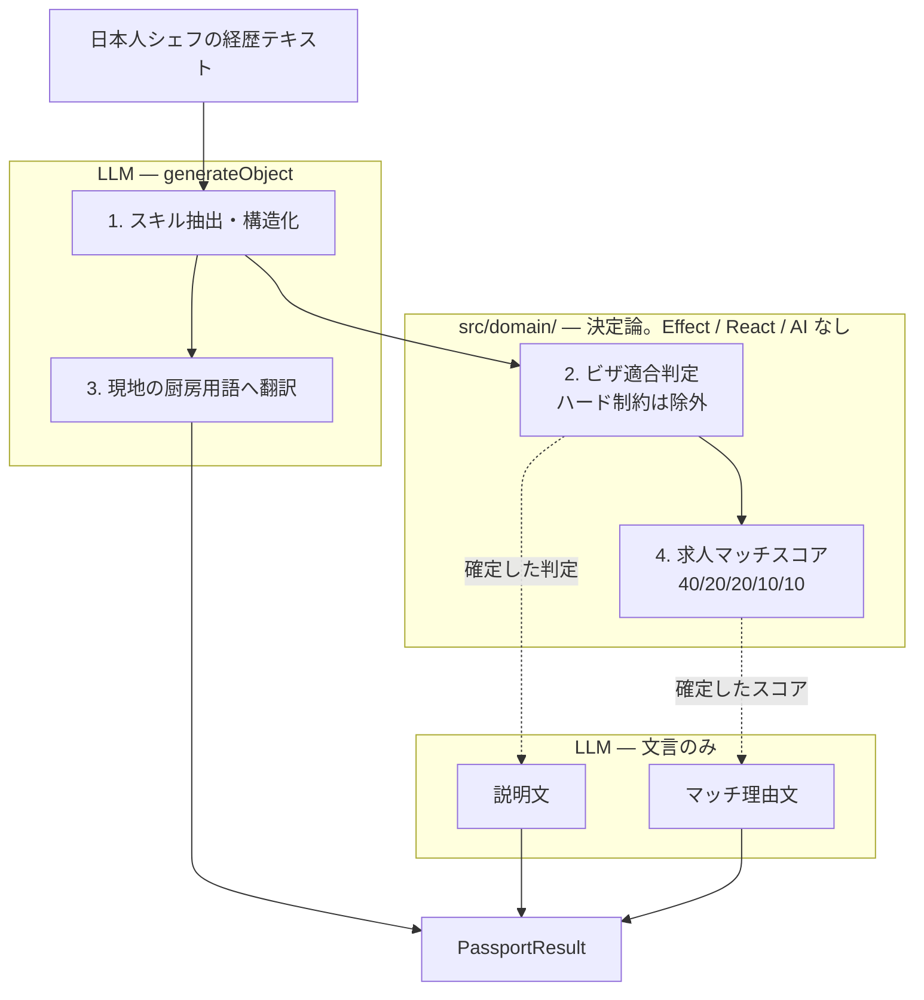

# Chef Passport

[](https://github.com/sc30gsw/chef-passport-poc/actions/workflows/ci.yml)
[](./LICENSE.md)
[](https://vercel.com)

**PoC.** 日本人シェフの経歴を入れると、「どの国の・どの厨房で・どのビザで通用するか」を提示するクロスボーダー・マッチングの試作です。

> ⚠ ビザ要件・求人はいずれも**デモ用モックデータ**であり、法的助言ではありません。各ビザカードには、モデルにした実在の政府ページへのリンクがあります。

対象は 3 カ国（シンガポール / オーストラリア / アメリカ）、就労ビザ 6 種、モック求人 15 件、プリセットシェフ 3 人。

## Features

### 3画面デモ — 選択 → 可視化 → 結果

面接官にプリセットシェフを選んでもらい、AI 処理の 4 ステップをリアルタイム表示したあと、国別適合度・ビザ要件・スキル翻訳・求人マッチをダッシュボードで見せます。一方通行の動画ではなく対話になります。

### 決定論的な判定 — 判断はコード、文章だけ LLM

適合判定と求人スコアは `src/domain/` の純関数。LLM はすでに決まった結果について**説明文を書くだけ**です。閾値を指差し、テストで固定し、誤判定を説明できます。

### ハード制約は減点ではなく除外

スポンサー不可・年齢上限超過・給与下限未達・実績証明不足などはスコアを削るのではなく**除外**し、除外理由を画面に出します。ロジックの存在が目に見えることがポイントです。

### コミット済みキャッシュ — 再現性 100%

プリセット 3 人は `vp run generate:passport` で生成したパイプライン出力をリポジトリにコミット。API キーもネットワークもなくデモできます。各ステップの**実測 ms** も記録し、画面 2 はその値で再生します（装飾用プログレスバーではありません）。

### 自由入力 — フラグでライブ API

サーバー側フラグ `ENABLE_FREE_INPUT`（既定 OFF）をオンにすると、任意の経歴でライブ生成できます。失敗時は佐藤 匠のキャッシュに退避し、バナーで明示します。

### 期待結果表が仕様そのもの

| ペルソナ  | SG  | AU  | US  | 決め手                                            |
| --------- | --- | --- | --- | ------------------------------------------------- |
| 佐藤 匠   | ◎   | ○   | △   | EP 給与基準クリア。417 は年齢超過。O-1 は実績証明 |
| 鈴木 遥   | ○   | ○   | △   | バランス型。482 スポンサー経路                    |
| 高橋 健太 | △   | ○   | △   | SG 給与下限に届かない。417 のみ                   |

この表は `src/domain/expected-outcomes.test.ts` に直接アサートされています。鈴木と高橋はどちらも AU ○ ですが**通るビザが違う**（482 vs 417）——その分岐もテストで固定し、「固定出力のプロンプトデモ」ではないことを示します。

## Architecture



点線が設計の核です。モデルは**すでに確定した判定結果**だけを受け取るので、説明文が判定と食い違う経路がありません。

詳細は [`docs/adr/0003-deterministic-scoring.md`](docs/adr/0003-deterministic-scoring.md) を参照してください。

```
┌──────────────────────────────────────────────────────────────┐
│     /  シェフ選択  →  /passport/$id  可視化  →  結果ダッシュ  │
│                     （/free は任意・フラグ制御）                │
└───────────────────────────────┬──────────────────────────────┘
                                ▼
┌──────────────────────────────────────────────────────────────┐
│  PassportPipeline — Stream<PipelineEvent>（Layer だけ差し替え） │
│  プリセット: コミット済みキャッシュ再生 / 自由入力: ライブ生成 │
└───────────────────────────────┬──────────────────────────────┘
                                ▼
┌──────────────────────────────────────────────────────────────┐
│  TanStack Start + Effect + @effect/ai → Vercel AI Gateway    │
│  domain/ は純関数。シリアライズ境界の外に AI を出さない        │
└──────────────────────────────────────────────────────────────┘
```

`PassportPipeline` は単一の `Stream<PipelineEvent>` を公開します。プリセットと自由入力で **差し替わるのは Layer だけ**——UI はどちらが動いているかで分岐しません。ストリームに error チャネルはありません。サーバー関数はプレーンなシリアライズ可能な値だけを返す必要があるため、失敗は `Failed` イベントとして流れます。

## Quick Start

**要件:** Node.js ≥ 24.17（[`.node-version`](.node-version)）と [Vite+](https://viteplus.dev/guide/) の `vp` CLI。

```bash
git clone https://github.com/sc30gsw/chef-passport-poc.git
cd chef-passport-poc

vp install
vp dev
```

[http://localhost:3000](http://localhost:3000) を開き、プリセットシェフを選んでください。**API キーもネットワークもなく**プリセットデモは動きます。

### 環境変数

`.env` に次を設定します。いずれも**サーバー専用**です。`VITE_` 接頭辞はクライアントバンドルに埋め込まれるため使わず、モジュールスコープではなくハンドラ内で読んでください。

| 変数                  | 用途                                                                              |
| --------------------- | --------------------------------------------------------------------------------- |
| `AI_GATEWAY_API_KEY`  | Vercel AI Gateway のキー                                                          |
| `AI_GATEWAY_BASE_URL` | 既定 `https://ai-gateway.vercel.sh`（末尾 `/v1` なし）                            |
| `ENABLE_FREE_INPUT`   | 既定 `false`。`true` にすると公開 URL から有料 API を叩く自由入力が有効になります |

モデルスラッグはプロバイダ接頭辞必須（`anthropic/claude-haiku-4.5`）。接頭辞なしだと 404 になります。

### Vercel へのデプロイ

[`vercel.json`](vercel.json) で `framework: tanstack-start` を指定しています。自由入力を本番で使う場合のみ、上記環境変数を Vercel に設定し `ENABLE_FREE_INPUT=true` をデプロイしてください。

## How It Works

> プロダクト要件とペルソナ／適合度の仕様は [`docs/requirement.md`](docs/requirement.md)、実装方針は [`.claude/rules/`](.claude/rules/) と [`docs/adr/`](docs/adr/) を参照してください。

1. **シェフ選択**: プリセット 3 人から選択（またはフラグ ON 時に自由入力）
2. **パイプライン**: スキル抽出 → ビザ適合 → スキル翻訳 → 求人スコア。判定ステップは決定論、文言だけ LLM
3. **ストリーム**: UI は `Stream<PipelineEvent>` を購読。プリセットはキャッシュ再生、自由入力はライブ
4. **フォールバック**: ライブ失敗時は佐藤 匠キャッシュへ退避。`PassportResult.proseSource` でモデル出力と決定論フォールバックを区別
5. **キャッシュ再生成**: `vp run generate:passport` が実パイプラインを回し、各ステップの実測時間を記録。`-- --offline` で決定論散文のみ書き出し可

## Layout

```
src/
├── domain/        純関数 — visa-eligibility / scoring。Effect・React・AI なし
├── data/          スキーマ、JSON フィクスチャ、デコードするローダー、コミット済みキャッシュ
├── features/      passport/{api,components,hooks,types}
├── lib/           runtime.ts（Layer 合成の単一地点）・ai-client.ts
├── routes/        薄いアダプタ: / · /passport/$personaId · /free
└── testing/       setup、render helper、server-fn mock、itEffect
scripts/           generate-passport.ts — 素の Node で実行
```

## Development

```bash
vp install                   # 依存関係
vp dev                       # 開発サーバー
vp check                     # format + lint + typecheck（--fix で自動修正）
vp test                      # 全テスト
vp build                     # 本番ビルド（Nitro → Vercel）
vp run generate:passport     # コミット済みパイプラインキャッシュを再生成
vp run fallow                # 未使用ファイル / export / 依存
vp run doctor                # React ヘルスチェック
```

`generate:passport` に `-- --offline` を付けるとモデルを呼ばず決定論散文を書き込みます。`proseSource: "deterministic"` として記録され、UI にバナー表示されます。

AI コーディングエージェント向けのノートは [`AGENTS.md`](AGENTS.md) を参照してください。

## Built With

- [TanStack Start](https://tanstack.com/start) — フルスタック React（SSR / サーバー関数）
- [Vite+](https://viteplus.dev) — 開発・ビルド・テスト・lint を一本化した CLI
- [Effect](https://effect.website) 3.22 + [`effect/Schema`](https://effect.website/docs/schema/introduction/) — 境界での検証とパイプライン
- [`@effect/ai`](https://github.com/Effect-TS/effect) — 構造化生成（`generateObject`）
- [Vercel AI Gateway](https://vercel.com/docs/ai-gateway) — モデルルーティング
- [Mantine](https://mantine.dev) 9 + [Tailwind CSS](https://tailwindcss.com) 4 — UI
- [Vercel](https://vercel.com) + [Nitro](https://nitro.build) — デプロイ

## Documentation

- [`docs/requirement.md`](docs/requirement.md) — 何を作るか、およびペルソナ／適合度の仕様（日本語）
- [`docs/adr/`](docs/adr/) — スタック選定、Gateway ルーティング、決定論スコアリング
- [`AGENTS.md`](AGENTS.md) — Vite+ ワークフローとプロジェクトルール

## License

[MIT](./LICENSE.md)
